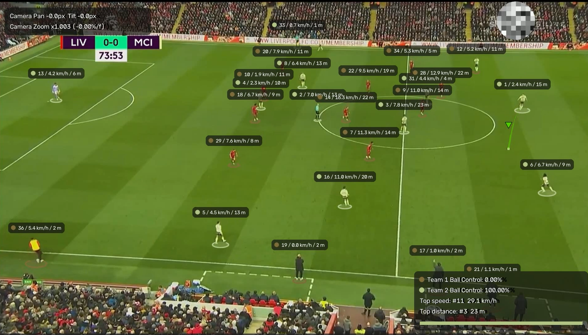

# ⚽ AI Football Match Analytics & Computer Vision Pipeline



Un pipeline complet et optimisé de vision par ordinateur développé en Python pour l'analyse de matchs de football à partir d'un flux vidéo de type "Broadcast Scouting Feed".

---

## 🚀 Fonctionnalités Clés

1. **Double-Passe (Two-Pass Processing) :** Analyse globale des trajectoires et des couleurs, suivie d'un rendu graphique haute fidélité.
2. **Détection & Suivi Avancé :** Intégration de **YOLOv8** couplé à **ByteTrack** (via `supervision`) avec support intelligent des modèles génériques (COCO) vs fine-tunés (filtrage des spectateurs en tribunes, distinction des arbitres).
3. **Compensation de Caméra (Pan, Tilt & Zoom) :** Utilisation du flot optique de Lucas-Kanade et correction d'échelle (Scale Compensation).
4. **Calibration & Homographie :** Transformation de perspective (`ViewTransformer`) pour convertir les coordonnées pixels en mètres réels sur le terrain.
5. **Analyse Cinématique & Possession :** Calculs lissés de la vitesse instantanée (km/h), distance parcourue, et algorithme de possession par équipe.
6. **Rendu "Broadcast" :** Interface moderne avec des éléments semi-transparents, des pastilles de suivi arrondies et des statistiques en temps réel.

---

## 📂 Structure du Projet

```text
├── APERCU.png          # Image d'aperçu du projet
├── foot.py             # Script principal du pipeline d'analyse
├── yolov8m.pt          # Modèle de détection YOLOv8
├── input.mp4           # Vidéo d'entrée du match
└── output_demo.mp4     # Vidéo de sortie générée avec les annotations
